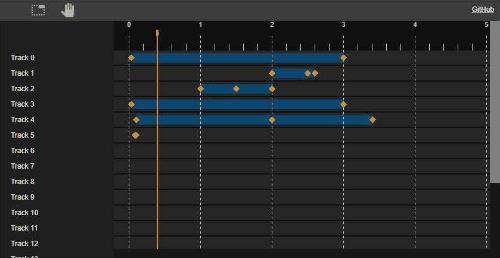

# animation-timeline-control

[npm](https://www.npmjs.com/package/animation-timeline-js)

Animation timeline is a TypeScript, no-dependency, canvas component designed to visualize and manipulate animation keyframes.

Features:

- Fast and customizable, rendered on a canvas.
- Snap, Zoom, Pan mode, multiple keyframes selection.
- Keyboard support.
- Drag multiple keyframes, drag keyframe ranges.
- Area virtualization - only small displayed area is rendered.
- Native browser scrollbars are used.
- Horizontal scale with the automatically adjusted ticks.


## Live Demo

- [Live demo](https://ievgennaida.github.io/animation-timeline-control/)
- [Run unittests](https://ievgennaida.github.io/animation-timeline-control/tests/unittests)

## Configuration

## Usage

### HTML/JavaScript

```JavaScript
<div id="timeline"></div>
<script type="text/javascript">
   let rows = [
      {
        keyframes: [
          {
            val: 40,
          },
          {
            val: 3000
          }
        ]
      }];

    let timeline = new timelineModule.Timeline({id:'timeline'})

    timeline.setModel({ rows: rows });
</script>
```

### Angular

```TypeScript
import {
  Timeline,
  TimelineRow,
  TimelineModel,
  TimelineOptions,
} from "animation-timeline-js";

const model = { rows: [] as Array<TimelineRow> } as TimelineModel;
const options = {
  id: "timeline",
  rowsStyle: {
    height: 35,
  } as TimelineRowStyle,
} as TimelineOptions;

const timeline = new Timeline(options, model);
```

### React

```TypeScript
import React, { useEffect, useRef, useState } from 'react';
import { Timeline, TimelineModel } from 'animation-timeline-js';
type Props = {
  time: number;
  model: TimelineModel;
};

function TimelineComponent(props: Props) {
  const { model, time } = props;
  const timelineElRef = useRef<HTMLDivElement>(null);
  const [timeline, setTimeline] = useState<Timeline>();

  useEffect(() => {
    let newTimeline: Timeline | null = null;
    // On component init
    if (timelineElRef.current) {
      newTimeline = new Timeline({ id: timelineElRef.current });
      // Here you can subscribe on timeline component events
      setTimeline(newTimeline);
    }

    // cleanup on component unmounted.
    return () => {
      timeline?.dispose();
    };
  // eslint-disable-next-line react-hooks/exhaustive-deps
  }, []);

  // Example to subscribe and pass model or time update:
  useEffect(() => {
    if (timeline) {
      timeline.setModel(model);
    }
  }, [model, timeline]);

  // Example to subscribe and pass model or time update:
  useEffect(() => {
    if (timeline) {
      timeline.setTime(time);
    }
  }, [time, timeline]);

  return <div ref={timelineElRef} />;
}
export default TimelineComponent;
```

### Outline list

Outline list\tree can implemented as a separate HTML component and synchronized with the timeline.
See the [live demo](https://ievgennaida.github.io/animation-timeline-control/)



## Model

Keyframes model is used to pass keyframes and rows to be visualized.
Component is using passed model for the visualization purpose and has no method to manage tracks or keyframes.
It also means that any attached metadata can be passed and it will be preserved
(Use case: you can attach additional data for each keyframe).

Read only and defined by the interfaces:

- TimelineModel
- TimelineRow
- TimelineKeyframe

Example on how to add a keyframe to existing model:

```JavaScript
    const existingModel = timeline.getModel();
    existingModel.rows[0].keyframes.append({ val: 20 });
    timeline.setModel(existingModel);
```

### Events

| Event name      | description                                                                                 |
| --------------- | ------------------------------------------------------------------------------------------- |
| timeChanged     | time changed. source can be used to check event sender. args type: TimelineTimeChangedEvent |
| selected        | keyframe is selected. args type: TimelineSelectedEvent                                      |
| scroll          | On scroll. args type: TimelineScrollEvent                                                   |
| dragStarted     | emitted on drag started. args type: TimelineDragEvent                                       |
| drag            | emitted when dragging. args type: TimelineDragEvent                                         |
| dragFinished    | emitted when drag finished. args type: TimelineDragEvent                                    |
| KeyframeChanged | emitted when drag finished. args type: TimelineKeyframeChangedEvent                         |

Events can be prevented by calling args.preventDefault()

Example of the type strict event subscription:

```TypeScript
this.timeline.onDragStarted((args: TimelineDragEvent) => {
    if (args) {
    }
});
```

### Timeline units and position

Expected that you have a component or engine that can execute playing a timeline. Ex: SVG has events to run the animations and report current time position. This component is meant only to visualize the position.

Time indicator position can be changed by a method call:

```JavaScript
timeline.setTime(1000);
```

Current time can be fetched by a method call or by an event:

```TypeScript
let units = timeline.getTime();

timeline.onTimeChanged((event: TimelineTimeChangedEvent) => {
  if(event.source !== TimelineEventSource.User) {
    units = event.var;
  }
});
```

Displayed units text can be changed by overriding a method:

```JavaScript
timeline._formatUnitsText = (val)=> { return val + ' ms'; };
```

### Styling

Timeline is rendered as a canvas, so has no HTML elements for the css styling.
Styles can be applied on a few levels:

- Global control setting (See TypeScript interface  TimelineStyle)
- row styles (See TypeScript interface TimelineRowStyle)
- keyframe styles (See TypeScript interface TimelineKeyframeStyle)

Styles are applied by a global settings and can be overridden by a row or keyframe style.

## Changes

## 2.2.1

 TypeScript fixes, updated build packages.

## > 2.0

- Migrated to TypeScript, Webpack, Babel.
- API is refined.

## < 2.0

Vanilla js implementation.

## Development

### Build

run once to install development references:

```bash
  npm install
```

Run next command to pack JavaScript as a bundle:

```bash
  npm run build
```

### Debug

VSCode is used as IDE and configuration is included to the project sources.

To debug project you should run command once files are changed:

```cmd
npm run build
```

Then navigate to the debug window and click 'Launch Debug File'.
Put breakpoint in any typescript file and trigger function from the browser.

Recommended extensions:

- markdownlint
- ESLint
- esbenp.prettier-vscode

### Dev Dependencies

Component has no production dependencies when built.
To pack and transpile TypeScript Babel + Webpack is used.
For the testing mocha and chai, as the assertion library are used.

### Build Tests

To build TypeScript unittests command should be executed:

```bash
  npm run build-tests
```

### Run Tests

Tests execution can be started by opening tests/unittests.html.
Mocha test libs are hosted on the internet, so connection is required.

## License

MIT
